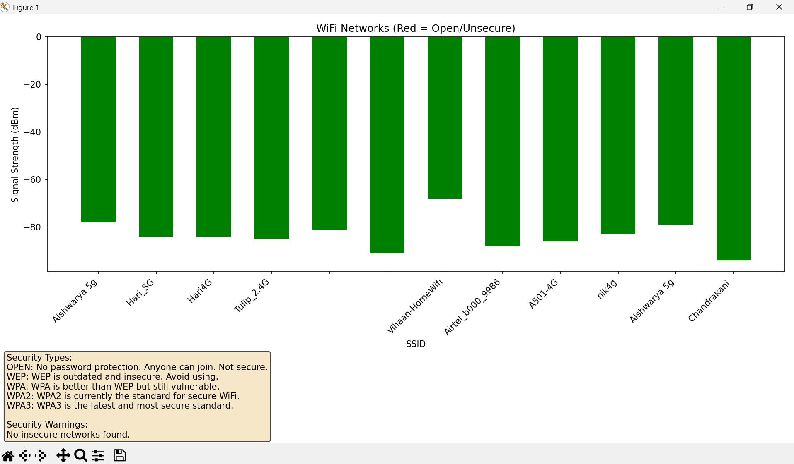
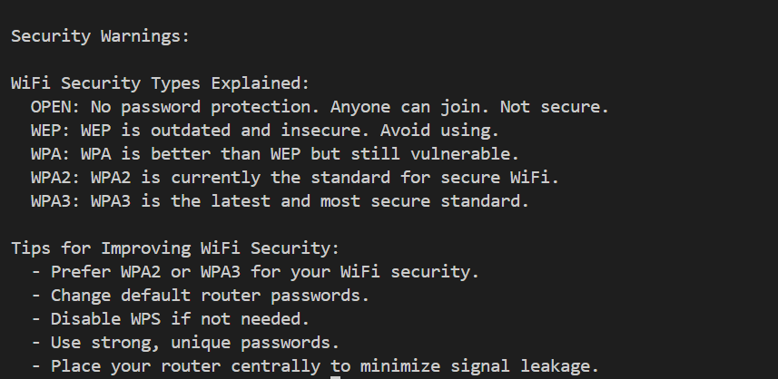

# WiFi Network Scanner

A cross-platform, professional-grade WiFi network scanner and analyzer built with Python. This tool scans for nearby wireless networks, visualizes their signal strengths, and provides instant security insights and recommendations—all in a clean, user-friendly interface.

##  Features

- **Cross-Platform Compatibility:** Works on Windows, Linux, and macOS using [pywifi](https://github.com/awkman/pywifi).
- **Real-Time WiFi Scanning:** Detects all nearby WiFi networks, displaying SSID, signal strength, channel, BSSID, and security type.
- **Professional Visualization:** Interactive, color-coded bar charts (vertical) for clear signal comparison. Insecure (open) networks are highlighted in red for immediate attention.
- **Built-In Security Analysis:** Instantly flags insecure (open or WEP) networks and displays tailored security warnings.
- **Expert Security Explanations:** Integrated, concise explanations of all major WiFi security types (WPA2, WPA, WEP, Open), plus actionable tips for improving your network security.
- **CSV Export:** Save scan results for further analysis or reporting.
- **Modular, Extensible Codebase:** Clean, well-documented Python modules for easy customization.

##  What Makes This Project Stand Out?

- **Security-First Visualization:** Security warnings and expert explanations are embedded directly in the visualization—no need to check the terminal or a separate file. Users instantly see which networks are risky and why.
- **Professional, Readable Charts:** Vertical bar charts with rotated SSID labels ensure clarity even with many networks, and color-coding makes weak security obvious at a glance.
- **Educational Value:** Not just a scanner—this tool teaches users about WiFi security, empowering them to make safer choices.
- **Ready for Integration:** Designed for easy extension into GUI apps, dashboards, or integration with other network tools.
- **Cross-Platform by Design:** Unlike many WiFi tools, this project works seamlessly across all major desktop operating systems.

##  Screenshots





##  Installation

1. **Clone the repository:**
    ```bash
    git clone https://github.com/abireshu/wifi-network-scanner.git
    cd wifi-network-scanner
    ```

2. **Set up a virtual environment (recommended):**
    ```bash
    python -m venv venv
    # On Windows:
    venv\Scripts\activate
    # On macOS/Linux:
    source venv/bin/activate
    ```

3. **Install dependencies:**
    ```bash
    pip install -r requirements.txt
    ```

## 🛠️ Usage

1. **Run the scanner:**
    ```bash
    python main.py
    ```

2. **View results:**
   - The script will scan for WiFi networks and display a vertical bar chart with security insights below.
   - Insecure networks are highlighted in red.
   - Security explanations and warnings are shown below the chart for quick reference.

3. **Export results (optional):**
   - Results can be saved as a CSV for further analysis.

## 🧩 Project Structure

```
wifi-network-scanner/
│
├── main.py
├── scanner.py
├── security_check.py
├── security_explanation.py
├── requirements.txt
└── README.md
├──screenshot.png
```

## 🛡️ Security & Privacy

- This tool does **not** attempt to connect to or interfere with any networks.
- No sensitive information is collected or transmitted.
- Designed for educational and diagnostic use.

## 👨‍💻 Contributing

Pull requests and feature suggestions are welcome! Please open an issue or submit a PR.

#internshipproject #TamizhanSkills #RISE #WIFI #networking
